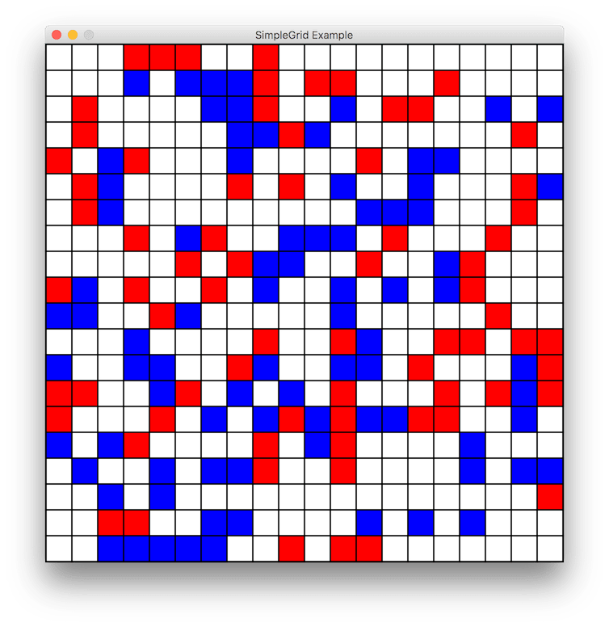
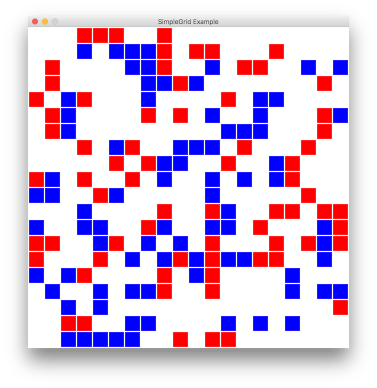
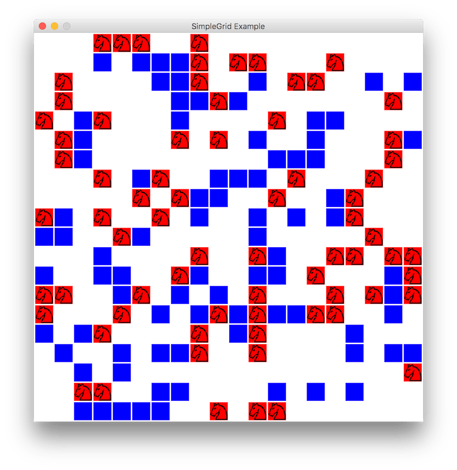

# Java Simple Grid #

This one file project provides the means for the creation, management, and display of a simple 2D graphical grid using Java's built in standard library.

## Overview ##
Creating a SimpleGrid will make a new window containing a grid with the specified settings. Each cell in the grid holds a numerical value, initially 0. The color and text of of each cell is dependent on what the value of the cell is. More grid layers can be added on top of the default one.

**Features include:**

* Creating grids with different dimensions and cell sizes
* Mapping integer values to colors, text, and text color
* Multiple grid layers
* Changing gridline thickness and color
* Editing functions such as filling and replacing
* Getting mouse input in terms of grid coordinates and button presses
* Full JavaDoc documentation

## Examples ##
```java
// Create new 20x20 grid with 30x30px cells and 2px gridline
SimpleGrid grid = new SimpleGrid(20, 20, 30, 2, "SimpleGrid Example");
```


```java
// Map colors and fill some random cells
grid.setColor(1, Color.BLUE);
grid.setColor(2, Color.RED);
for (int i = 0; i < 100; i++) {
    grid.set(random.nextInt(20), random.nextInt(20), 1);
    grid.set(random.nextInt(20), random.nextInt(20), 2);
}
```



```java
// Change color of gridlines
grid.setGridlineColor(Color.WHITE);
```



```java
// Add a layer on top of the existing one(s)
grid.addLayer();
grid.setColor(-1, Color.BLACK);
for(int i = 0; i < 20; i++) {
    grid.set(1, random.nextInt(80), random.nextInt(50), -1);
}
```



```java
// Map text to cells
for(int i = 2; i < 9; i++) {
    grid.setText(i, ("" + i).charAt(0));
}
```


## License ##
This project is licensed under the MIT license. See [LICENSE](LICENSE) for details.
